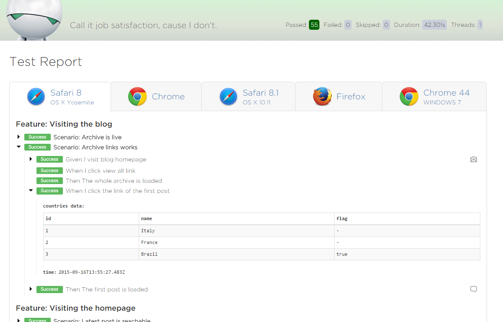
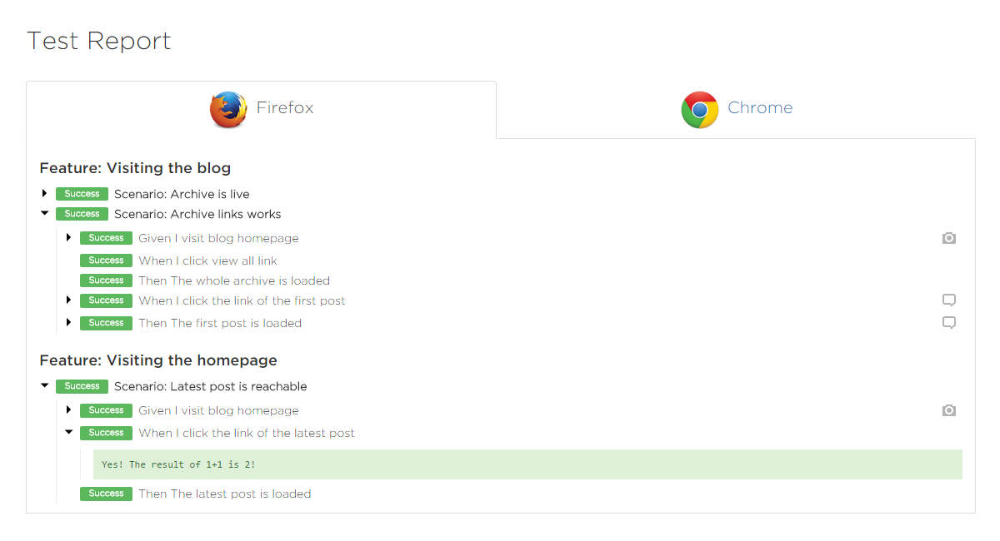
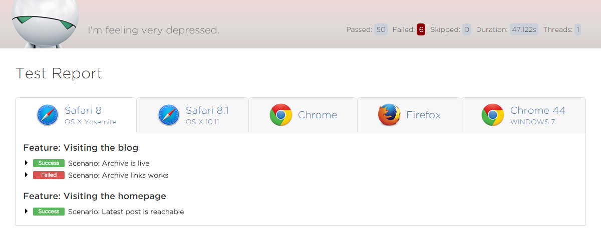
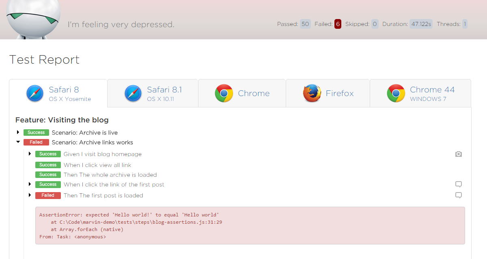

# marvin-js


An easy to use lightweight web testing framework for Node, designed for speed, maintainability and collaboration, now multi-browser. Bringing together everything you need out of the box - familiar BDD features/scenarios, a simple page object library, parallel testing and pretty rich reports, integrating [Yadda 0.16.0](https://github.com/acuminous/yadda), [Selenium-Webdriver 2.48.2](https://code.google.com/p/selenium/wiki/WebDriverJs), [Mocha 2.3.3](http://mochajs.org/) & [Chai 3.4.1](http://chaijs.com/).

[](https://nodei.co/npm/marvin-js/)

#### Credits

marvin-js was born as a clone of LateRooms' [Moonraker](https://github.com/LateRoomsGroup/moonraker).

## Index

* [Install](#install)
* [Example Project](#example-project)
* [Configure](#configure)
* [Run](#run-your-tests)
* [Writing Your Tests](#writing-your-tests)
* [Page Objects](docs/page-object.md)
* [Components](#components)
* [Feature Tags](#feature-tags)
* [Assertions](#assertions)
* [Saucelabs / Browserstack integration](#saucelabs--browserstack-integration)
* [Running your tests in parallel](#running-your-tests-in-parallel)
* [Managing state](#managing-state)
* [Reporting](#reporting)
* [Page object reference](#page-object-reference)
* [Session reference](#session-reference)

### Install

It is possible to install marvin-js via [npm](https://www.npmjs.org/) - `$ npm install marvin-js`, or add `marvin-js` to your `package.json`.

### Example project

You will find a full example project in the [marvin-demo](https://github.com/brunoscopelliti/marvin-demo) repository with everything you need to start using marvin-js - sample feature, step definitions, page objects and config in a suggested project structure.

The example tests use Chrome, so you will need the latest [chromedriver](http://chromedriver.storage.googleapis.com/index.html) downloaded and available on your path.

`npm install` then `npm test` from within the example directory to run the sample feature.

### Configure

marvin-js is configured using a `config.json` file in your project root:

```json
{
  "baseUrl": "http://www.github.com/brunoscopelliti",
  "featuresDir": "tests/features",
  "stepsDir": "tests/steps",
  "resultsDir": "results",
  "reporter": "marvin",
  "threads": 1,

  "tags": "@dev",

  "testTimeout": 60000,
  "elementTimeout": 5000,

  "browsers": [{
    "browserName": "chrome"
  }, {
    "seleniumServer": "http://ondemand.saucelabs.com:80/wd/hub",
    "browserName": "safari",
    "platform": "MAC"
  }]
}
```

* `baseUrl`        - Your base url, page object urls will be relative to this.*
* `featuresDir`    - The path to your features directory.*
* `stepsDir`       - The path to your step definitions directory.*
* `resultsDir`     - The path you'd like your results output to. *
* `reporter`       - The reporter type you'd like marvin-js to use (more on this [below](#reporting)).
* `threads`        - The number of threads you'd like to run with. Note that Marvin will this number of threads for each browser. (default: 1)
* `tags`           - Optional: Comma seperated list of feature tags (more on this [below](#feature-tags)).
* `testTimeout`    - The maximum test (scenario step) timeout before its marked as a fail (ms). (Default: 60000)
* `elementTimeout` - The maximum time selenium will continuously try to find an element on the page (ms). (Default: 3000)
* `browsers`       - An array of objects, each one describing one browser's [desired capabilities](https://code.google.com/p/selenium/wiki/DesiredCapabilities) and optionally a `seleniumServer` address.*
* `language`       - Optional: sets the language to use (default: English).

\* - Required.

#### Custom selenium servers

The example configuration above assumes using Chrome directly, and you're connecting to a different Selenium server only for one browser. You can use this to connect to cloud service providers like [Saucelabs](https://saucelabs.com/) and [Browserstack](https://www.browserstack.com/automate), even for only one browser. Please see [below]() for example browser configurations.

You can also set which language to use, using `language`, if you intend to use non English feature & step definition files. A full list of supported languages is available [here](https://github.com/acuminous/yadda/tree/master/lib/localisation).

### Run your tests

To start marvin-js run `$ node node_modules/marvin-js/bin/marvin.js`, or to make things easier you can add a shortcut in your `package.json`:

```json
{
  "scripts": {
    "test": "node node_modules/marvin-js/bin/marvin"
  }
}
```
... so you can simply run `$ npm test`. Note, you cannot pass command line args using the `$ npm test` shortcut.

### Writing your tests

Tests for marvin-js are written using [Yadda](https://github.com/acuminous/yadda), a BDD implementation very similar to [Cucumber](http://cukes.info/) and run using the [Mocha](http://visionmedia.github.io/mocha/) JavaScript test framework.

Just like Cucumber, Yadda maps ordinary language steps to code, but can be quite flexible by not limiting you to a certain syntax (Given, When, Then) and allowing you to define your own...

```
Feature: Searching from the homepage

  Scenario: Simple Search

    Given I visit the home page
    When I search for 'Manchester'
    Whatever language I like here
```

```javascript
exports.define = function (steps) {

  steps.given("I visit the home page", function () {
    // some code
  });

  steps.when("I search for '$query'", function (query) {
    // some code
  });

  steps.define("Whatever language I like here", function() {
    // some code
  });

};

```

Although Yadda can support multiple libraries, marvin-js currently loads all step definitions found in your steps directory into one big shared library, just like Cucumber, so you have to be careful of step name clashes.


### Components

Components are exactly like page objects and allow you to group elements together into a component, then add that component itself to a page object.

```javascript
// tests/pages/components/nav.js
var Component = require('marvin-js').Component

module.exports = new Component({

  selLanguage: { get: function () { return this.element('.locale select'); } },
  selCurrency: { get: function () { return this.element('.currency select'); } }

});
```

```javascript
// tests/pages/home.js
var Page = require('marvin-js').Page,
    nav = require('./components/nav');

module.exports = new Page({

  url: { value: '/' },
  nav: { get: function () { return this.component(nav, "section[class='header']"); } },
  ...

});
```

Components are added to a page just like elements are but using:
`this.component(component, rootNode)` where 'component' is your component object, and 'rootNode' is a css selector representing your components root node on the page.

All elements in your component are then scoped to this rootNode, so in the above example the element `selLanguage` with its `.locale select` selector is only found within the `section[class='header']` element.

Your components can then be re-used across your page-objects and could appear in different places on the page.

Using your components:

```javascript
// tests/steps/home-search-steps.js
var homePage = require('../pages/home');

exports.define = function (steps) {

  steps.given("I visit the home page", function () {
    homePage.visit();
  });

  steps.when("I select my currency", function () {
    homePage.nav.selCurrency.click();
    // etc..
  });

});

```

### Feature Tags

marvin-js supports feature tags to help keep things organized and allow you to selectively run certain features:

```
@testing
Feature: Searching from the homepage

  Scenario: Simple Search

    Given I visit the home page
    ...
```

In your config.json you can specify `"tags": "@testing"` to only run features with that tag or use `'!@testing'` to ignore those features. You can also use a comma seperated list - `@accounts,@booking` etc. Features tagged as `@Pending` will be skipped but included as pending features in the marvin-js test report.


### Assertions

The 'should' style of the [Chai](http://chaijs.com/guide/styles/) assertion library is available to use in your step definitions.

### Saucelabs / Browserstack integration

To run your tests on cloud service providers like [Saucelabs](https://saucelabs.com/) and [Browserstack](https://www.browserstack.com/automate) you just need to configure marvin-js with the correct `seleniumServer` address and browser capabilities that include your username/access key:

Saucelabs:
```json
"browsers": [{
    "seleniumServer": "http://ondemand.saucelabs.com:80/wd/hub",
    "username": "{{YOUR_SAUCELABS_USERNAME}}",
    "accessKey": "{{YOUR_SAUCELABS_ACCESS_KEY}}",
    "browserName": "safari",
    "version": "8.0",
    "platform": "OS X 10.10"
}]
```
Browserstack:
```json
"browsers": [{
    "seleniumServer": "http://hub.browserstack.com/wd/hub",
    "browserstack.user": "{{YOUR_BROWSERSTACK_USERNAME}}",
    "browserstack.key": "{{YOUR_BROWSERSTACK_KEY}}",
    "browserName": "Safari",
    "browser_version": "8.0",
    "os": "OS X",
    "os_version": "Yosemite",
    "resolution": "1920x1080"
}]
```
Note: As you can see in these examples each provider specifies capabilites differently so you will need to refer to your provider documentation:

* https://docs.saucelabs.com/reference/platforms-configurator/
* http://www.browserstack.com/automate/capabilities

### Running your tests in parallel

marvin-js was designed with speed in mind and supports testing in parallel. To take advantage of this you can either:

- add new browsers in the `browsers` config
- increase the number of `threads` in the config

marvin-js will run all your browsers in parallel, with `threads` threads for each browser.

When you use more the one `threads`, marvin-js will split your feature files over the amount of threads set and starts a new child process (and browser) for each. If you have 4 feature files and want to use 2 threads, 2 features will be executed per thread / browser etc.

Parallel testing works as expected for remote driver connections just as it does locally. If you have powerful enough hardware to run your tests on and a large, high performing selenium grid instance to open connections to, you can dramatically reduce your test execution time.

At best, you will only be as quick as your longest running feature though, so if you have features with tons of scenarios in them you should think about breaking them down into smaller more manageable feature files.

### Managing state

To share state between separate step libraries you can use Yadda\'s [contexts](https://acuminous.gitbooks.io/yadda-user-guide/content/en/usage/managing-state.html).

### Reporting

As the tests are run using Mocha, you can use any of Mocha's [reporters](http://mochajs.org/#reporters). Just set the required reporter in the config. As Mocha is designed to run serially though you will experience issues when running marvin-js in parallel, so marvin-js comes with its own custom reporter for Mocha.

#### marvin-js reporter

To use it set the reporter in your config to `marvin`. This reporter includes a Mocha spec-like console output and a html report saved to your results directory.
The html report includes details of any errors and embedded browser screenshots.


*Successful tests report*


*Successful tests with steps expanded*


*Successful tests with steps and log values as table*


*Successful tests with steps and log values as text*


*Failed tests report*


*Failed tests with steps expanded*

If you are using marvin-js in a non English language (set in the config) the report will try to find matching translations from [this file](https://github.com/brunoscopelliti/marvin/blob/master/lib/reporter/i18n/translations.json), defaulting to English if any are missing. Please feel free to contribute any translations that you may require.

#### marvin-js reporter's

### Page object reference

As the examples show, all interactions with page elements (and the underlying driver) are abstracted away in your page objects. When you create a page object you have various ways of attaching elements to it so they can be interacted with in your step definitions:

```javascript
var Page = require('marvin-js').Page;

module.exports = new Page({

  url: { value: '/search' },

  aTxtInput:  { get: function () { return this.element("input[id='txtSearch']"); } },
  buttons:    { get: function () { return this.elements("button"); } },
  aSelect:    { get: function () { return this.select("select[name='rt-child']"); } },
  aComponent: { get: function () { return this.component(yourComponent, "div[class='container']"); } },

  onLoad: { value: function () {
    // Some code to run immediately after the page is loaded.
  } }

});
```

* Setting a url value is for when you call `visit()` on your page object. e.g: `examplePage.visit();`. These url's are relative to the baseUrl set in your config, but if you set a full url like `http://www.example.com` the baseUrl will be ignored. Additionally, `visit()` can take an optional query object with two possible properties: pathValues that contains an array with URL placeholder replacements, and querystring that contains a query string like `?param1=value1&param2=value2`, e.g. `examplePage.visit({querystring: '?param1=value1&param2=value2' });` will visit `http://yourBaseUrl?param1=value1&param2=value2`.

* `element(selector, type)` - is used to find a specific element by selector type and returns a selenium webelement. The type is optional and if not supplied the default of 'css' is used (as in the examples above). You can specify another locator type if required - `this.element('//a/b/c', 'xpath')`. Elements are then accessed from your page objects: `examplePage.aTxtInput.click();`. All of [Selenium's locator](https://code.google.com/p/selenium/source/browse/javascript/webdriver/locators.js#212) types are supported.

* `elements(selector, type)` - is used to find all elements on the page that satisfy the selector and returns a collection of selenium webelements. e.g:
```javascript
examplePage.buttons.then(function (elems) {
  elems.forEach(function (elem) {
    // etc..
  });
});
```

* `select(selector, type)` - is the same as `element` but adds a helper `selectOption(optionValue)` to the element to enable easy option selection. e.g: `examplePage.aSelect.selectOption(3);`

* `component(yourComponent, rootNode)` - Attaches a component you have defined to your page. Please see [components](#components).

There are some additional helper methods you can use:

* `waitFor(fn, timeout)` - Exposes selenium's `driver.wait`, to explicitly wait for a specific condition to be true. e.g:
```javascript
search: { value: function (query) {
    var _this = this;
    this.waitFor(function () {
      return _this.aTxtInput.isDisplayed();
    }, 5000);
    this.aTxtInput.sendKeys(query);
} }
```

* `onLoad()` - An optional function you can define that is run when the page is loaded.

Components are the same and have access to the same element methods, but not the page specific ones: `visit()`, `title()`, `alert()` & `component()`.
Please see the official [selenium webdriver](https://code.google.com/p/selenium/wiki/WebDriverJs) documentation for further information on working with elements.

### Session reference

marvin-js uses a session object to group functions related to the current test session and can be used in your step definitions etc:
```javascript
var session = require('marvin-js').session;
session.resizeWindow(320, 480);
```

* `execute(fn)` - Adds any function to webdriver's control flow. Please see [control flows](https://code.google.com/p/selenium/wiki/WebDriverJs#Control_Flows).
* `resizeWindow(x, y)` - Resizes the browser window. By default its maximized.
* `refresh()` - Refreshes the current page.
* `saveScreenshot(filename)` - Saves a screenshot to `/yourResultsDir/timestamp/screenshots/filename`. This is called automatically on test failure.
* `deleteAllCookies()` - Deletes all cookies.
* `addCookie(name, value, optDomain, optPath, optIsSecure, optExpiry)` - Adds a cookie.
* `getCookie(name)` - Gets a cookie by name.
* `getWebdriver()` - Returns a reference to Webdriver that can be used, for instance, to create a new promise, e.g.
```javascript
 var deferred = new session.getWebdriver().promise.Deferred();
```
* `getCurrentUrl()` - Returns an url object, e.g:
```javascript
Url {
    protocol: 'https:',
    slashes: true,
    auth: null,
    host: 'myhost.com',
    port: null,
    hostname: 'myhost.com',
    hash: null,
    search: null,
    query: null,
    pathname: '/mydir/mysubdir',
    ath: '/mydir/mysubdir',
    href: 'https://myhost.com/mydir/mysubdir' 
}
```

## Done / planned development since we cloned Moonraker

* [X] **updated all dependencies**; simplified report's dependencies management; removed coffeescript (not a big fan, sorry)
* [X] refactoring directory tree
* [X] support Yadda's custom dictionary
* [X] store reports in different folders, so that a new test does not clear result's history; it is possible to enable the cleaning of the result folder via configuration, with `"clean": true`
* [X] POC logging from test steps in the report
* [X] POC not-blocking assertions
* [X] Support for simultaneous test run on multiple browsers and multiple selenium hubs
* [X] make possible to include screenshot into the report
* [ ] refactoring feature-parser.js: it should not be in /utils
* [ ] improve [demo repository](https://github.com/brunoscopelliti/marvin-demo) with more scenarios, like smartphone version scenarios and/or responsive design scenarios.
* [ ] integrating selenium-webdriver [until's module](https://github.com/SeleniumHQ/selenium/blob/master/javascript/node/selenium-webdriver/CHANGES.md#v2440)
